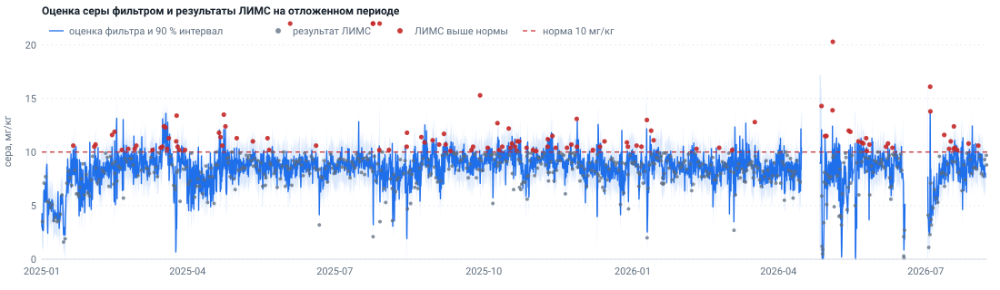
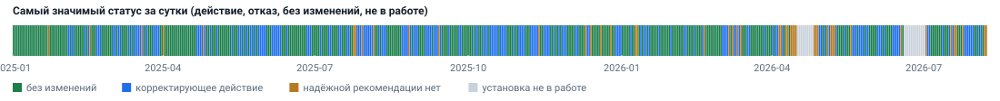
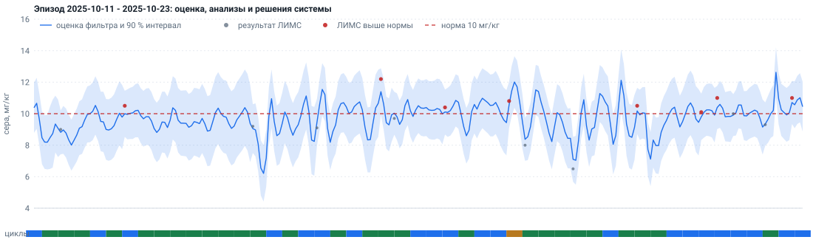
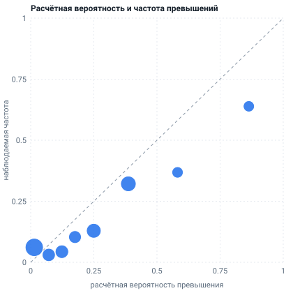
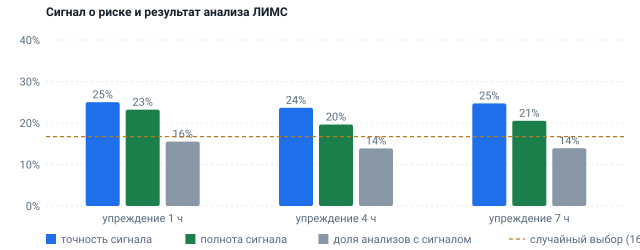
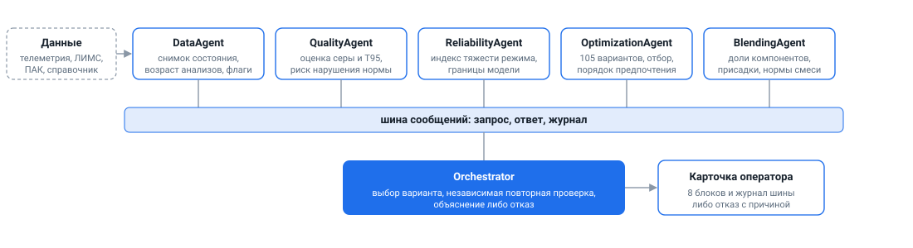

# Система поддержки решений оператора: АВТ, гидроочистка, блендинг

Мультиагентная система по цепочке АВТ → гидроочистка дизельного топлива (24-2000) → блендинг. Каждый цикл она собирает состояние
процесса из телеметрии, ЛИМС и анализаторов ПАК, проверяет данные, оценивает содержание серы в продукте и риск выхода за норму
(не более 10 мг/кг), формирует допустимые варианты изменения режима, отсекает нарушающие ограничения, выбирает вариант и объясняет
выбор оператору. Если допустимого решения нет или данных недостаточно, система сообщает об этом и называет причину.

[Сводка результатов](outputs/dashboard.html) (скачайте файл и откройте в браузере) · [Обоснование решений](docs/02_ОБОСНОВАНИЕ.md) ·
[Числа прогона](docs/03_РЕЗУЛЬТАТЫ.md) · [Источники допущений](docs/05_ИСТОЧНИКИ_ДОПУЩЕНИЙ.md)



## Если у вас пять минут

| Что хочется узнать | Куда посмотреть |
|---|---|
| Что делает система и что она выдаёт оператору | [пример карточки](outputs/demo/02_риск_по_сере.md) ниже; ещё девять сценариев — [outputs/demo/](outputs/demo) |
| Результаты и выводы одним экраном | [outputs/dashboard.html](outputs/dashboard.html): графики, выводы, демонстрационные карточки |
| Все числа прогона | [docs/03_РЕЗУЛЬТАТЫ.md](docs/03_РЕЗУЛЬТАТЫ.md) |
| Почему выбраны именно эти методы, пороги и допущения | [docs/02_ОБОСНОВАНИЕ.md](docs/02_ОБОСНОВАНИЕ.md): раздел 16 — происхождение каждого значения и чувствительность |
| Откуда взято каждое значение конфигурации | [docs/05_ИСТОЧНИКИ_ДОПУЩЕНИЙ.md](docs/05_ИСТОЧНИКИ_ДОПУЩЕНИЙ.md), копии документов — [docs/источники/](docs/источники) |
| Как устроены агенты и что делает каждый | [docs/00_СОСТАВ_СИСТЕМЫ.md](docs/00_СОСТАВ_СИСТЕМЫ.md), код — [mas/agents/](mas/agents) |
| Что в данных и как они очищались | [docs/01_ДАННЫЕ.md](docs/01_ДАННЫЕ.md) |
| Что не получилось и почему | раздел «Ограничения» ниже, [docs/00_СОСТАВ_СИСТЕМЫ.md](docs/00_СОСТАВ_СИСТЕМЫ.md) раздел 8 |
| Как проверить самому | раздел «Запуск» ниже, [интерактивный просмотр](#интерактивный-просмотр) |

## Результаты

Обучение — 2023-01-01 … 2024-12-31, проверка на данных, отделённых по времени, — 2025-01-01 … 2026-08-08. Данных после этой даты нет.

| Показатель | Значение | Файл |
|---|---|---|
| Отличение превышения нормы по сере (AUC), оценка перед анализом | фильтр 0.79; среднее двух приборов 0.71; «последний анализ» 0.62; бустинг по режимным тегам 0.46 | [validation.json](outputs/validation.json) |
| Brier оценки серы | 0.126 при 0.139 у климатологии; покрытие 90 %-го интервала 0.92 | [validation.json](outputs/validation.json) |
| Внутренняя проверка (подбор по 2023, оценка по 2024) | AUC фильтра 0.77, среднего двух приборов 0.77: преимущество вне выборки не подтверждено | [internal_holdout.json](outputs/internal_holdout.json) |
| Бэктест, 2336 циклов с шагом 6 ч | без изменений 77.1 %, корректирующее действие 13.2 %, надёжной рекомендации нет 5.2 %, установка не в работе 4.5 % | [backtest_summary.json](outputs/backtest_summary.json), [backtest_cycles.csv](outputs/backtest_cycles.csv) |
| Сигнал о риске на цикле (упреждение 1 ч) | точность 25 %, полнота 23 % при доле превышений 16.7 % | [backtest_summary.json](outputs/backtest_summary.json) |
| Проверка отклика на записанных данных | знак и порядок величины по ступенчатым изменениям совпадают на обоих периодах; советы по T5 согласуются с действиями операторов | [effect_check.json](outputs/effect_check.json) |
| Формулы виртуального анализатора | пригодных 0 из 25 сверок | [vak_regulation.csv](outputs/vak_regulation.csv) |
| Тесты | 151, включая проверку отсутствия утечки из будущего и работоспособности ссылок README | [tests/](tests) |

Выводы, которые из этого следуют:

* Оценку серы «сейчас» система строит лучше простых оценок и, в отличие от бустинга по режимным тегам, различает превышение нормы. Вне выборки
  это преимущество не подтверждено, поэтому оценка остаётся фильтром ради интервала неопределённости и работы при отказе прибора.
* Заглянуть вперёд на часы данные не позволяют: прогноз превышения на 4 ч не лучше климатологии (AUC 0.55), сигнал на цикле слабо информативен.
  Причина — замкнутый контур регулирования и погрешность лаборатории; решения принимаются по текущей оценке.
* Надёжная часть системы — отсев и отказ: недопустимый вариант не может быть выбран, а при отсутствии допустимого система отказывается и называет причину.
* Эффект действий рассчитан моделью и на замкнутом контуре не проверен; чем именно проверено косвенно — в [docs/02_ОБОСНОВАНИЕ.md](docs/02_ОБОСНОВАНИЕ.md), раздел 2.7.

### Графики

Все рисунки строятся командой `python run.py dashboard` из файлов `outputs/` (тот же код рисует страницу сводки).





| Расчётная вероятность и наблюдаемая частота превышений | Сигнал о риске и результат анализа |
|---|---|
|  |  |

## Как работает один цикл



1. **DataAgent** формирует снимок состояния на момент времени, хранит возраст каждого анализа и флаги качества (заморозка и насыщение анализаторов, код 307, переходный режим).
2. **QualityAgent** оценивает серу и T95 сейчас и на 4 ч, вероятность выхода за норму, доверие к оценке; оценивает варианты действий по ансамблю из 27 оценок отклика.
3. **ReliabilityAgent** считает индекс тяжести режима по признакам (T5, перепад давления, цикл катализатора и др.) и границы допустимых значений.
4. **OptimizationAgent** перебирает 105 вариантов (изменение T5, снижение загрузки F9, изменение отбора F32) и упорядочивает допустимые: больший выпуск, затем меньшее изменение режима.
5. **BlendingAgent** проверяет доли (сумма 100 %), нормы смеси и присадки.
6. **Orchestrator** выбирает вариант, независимо перепроверяет его и формирует карточку либо отказ.

Агенты обмениваются сообщениями только через шину [mas/bus.py](mas/bus.py); журнал шины входит в каждую карточку.

### Пример карточки оператора

Момент 2025-10-22 00:00: оценка серы 10.3 мг/кг при норме 10, вероятность превышения 62 %. Полная карточка — [outputs/demo/02_риск_по_сере.md](outputs/demo/02_риск_по_сере.md).

```
Статус: КОРРЕКТИРУЮЩЕЕ ДЕЙСТВИЕ
2. Проблема / риск   P(S>10) сейчас 62 %, через 4 ч 52 %; ПАК 6.77, Q21 8.00, возраст ЛИМС 2 ч
3. Предлагаемое действие
   T5   378.07 -> 380.07 °C (+2.00)
   F9   252.70 -> 240.07 т/ч (-12.64)
4. Ожидаемый эффект
   P(S>10) с действием / без него: 16 % / 62 %;  при самом слабом отклике: 42 %
   выпуск -12.23 т/ч; T95 343.8 °C; энергозатраты не оцениваются
5. Проверка ограничений   сера <= 10: выполнено; шанс-ограничение: 4 %; T95 не навреди: выполнено; границы: выполнено
7. Объяснение   Из 30 допустимых вариантов выбран с наибольшим выпуском; альтернативы уступают по размеру изменения режима
```

## Запуск

Данные (телеметрия, ЛИМС, ПАК, справочники) в репозиторий не входят. Нужны файлы пакета задания: `avt_tags.csv`, `242000_tags.csv`,
`ЛИМС….xlsx`, `Выгрузка ПАК….xlsx`, уточнённые `теги АВТ_24-2000.xlsx` и `формулы_ВАК.xlsx` (исходный `Теги….xlsx` используется, только если
уточнённого нет). Файлы ищутся по шаблонам из [config/settings.yaml](config/settings.yaml) (раздел `files`) в папке `--data`, в переменной окружения `NEFTEKOD_DATA` либо, если ни то ни другое не задано, в папке `data/` в корне репозитория (её не добавляйте в коммит).

```bash
pip install -r requirements.txt        # разработано и проверено на Python 3.13
python run.py all --data <папка с исходными файлами>   # без --data: папка data/ в корне репозитория
```

Всё одной командой, включая тесты: `python run.py all && pytest` (при папке `data/` в корне репозитория путь не нужен).

Полный прогон занимает около 15–20 минут на настольном компьютере (разбор данных, калибровка фильтра серы, состояние, проверка, демо, бэктест, проверка отклика, документы, сводка).
Результаты записываются в `outputs/` и `docs/`; готовые результаты последнего прогона уже лежат в репозитории.

```bash
python run.py cycle --time "2025-10-22 00:00"      # одна карточка оператора (после all)
python run.py cycle --time "2025-10-22 00:00" --blend-mode scenario
pytest                                             # тесты (после all: им нужен кэш данных)
python tools/live_viewer/server.py 8899           # интерактивный просмотр, затем http://localhost:8899
```

Отдельные шаги, если нужен только один:

| Команда | Что делает |
|---|---|
| `python run.py prepare --data <папка>` | разбор источников, флаги качества, аудит справочника, кэш в `cache/` |
| `python run.py calibrate` | калибровка по обучающему периоду в `config/calibrated.json`; `--global-search` — заново найти стартовую точку фильтра серы (десятки минут) |
| `python run.py state` | причинные ряды состояния в `cache/` |
| `python run.py validate` | метрики на отложенном периоде и регламент ВАК |
| `python run.py demo` | 10 демонстрационных сценариев в `outputs/demo/` |
| `python run.py backtest --step 6` | весь отложенный период по циклам (частями, с продолжением) |
| `python run.py effect` | проверка модели отклика на записанных данных (после `backtest`) |
| `python run.py holdout` | внутренняя проверка фильтра серы: подбор по 2023, оценка по 2024 (около 40 минут, в `all` не входит; результат лежит в `outputs/internal_holdout.json`) |
| `python run.py docs` / `dashboard` | `docs/03_РЕЗУЛЬТАТЫ.md`, `docs/05_ИСТОЧНИКИ_ДОПУЩЕНИЙ.md` / `outputs/dashboard.html` и рисунки `docs/img/` |

Рекомендация считается на любой момент (шаг данных 10 минут); в бэктесте, демонстрации и просмотре — каждые 6 часов.

## Интерактивный просмотр

```bash
python tools/live_viewer/server.py 8899
```

Откройте [http://localhost:8899](http://localhost:8899). Сервер использует стандартную библиотеку; ему нужны результаты `python run.py all`.

* воспроизведение времени с шагом 6 часов и карточка оператора на каждый момент, кнопка «Сводка результатов» открывает дашборд;
* сценарные значения ΔT5, ΔF9 и ΔF32 с повторным расчётом («что будет, если»);
* панель «Параметры модели и приборов»: около тридцати допущений, влияющих на результат (диапазоны и шум анализаторов, допустимая
  вероятность, сорт товарного ДТ, границы цикла катализатора, режим блендинга). У каждого указаны источник, единицы, допустимые границы и значение
  по умолчанию; нормативные значения показаны, но не редактируются. Изменения существуют только в памяти сервера, файлы не меняются, набор
  изменений выгружается в JSON и загружается обратно;
* изменения приборов и ЛИМС пересчитывают фильтр серы по всему периоду (10–30 секунд), остальные действуют сразу.

## Сценарный блендинг

Свойства компонентов смешения (кроме ГО ДТ), присадок, их запасы и величина партии в материалах проекта не заданы, поэтому по умолчанию
(`mode: product_only`) товарное ДТ равно ГО ДТ и проверяется по нормам сорта (сера, T95, цетановое число, плотность). Блендинг
задаётся сценарием: пользователь вносит условные данные в раздел `blending` файла [config/settings.yaml](config/settings.yaml) (значения — допущение
эксперимента, не свойства установки), и система подбирает рецептуру (`scenario`) либо проверяет заданную (`manual`). Пример:

```yaml
blending:
  main_component: "ГО ДТ (24-2000)"
  mode: {value: scenario}                       # product_only | scenario | manual
  share_step: {value: 0.05}                     # шаг сетки долей
  batch_t: {value: 1000}                        # партия, т
  main_stock_t: {value: 100000}                 # запас ГО ДТ, т
  main_share_range: {value: [0.0, 1.0]}         # допустимая доля ГО ДТ
  rule_margins: {value: {T95: 3.0, CFPP: 2.0, cetane: 1.0}}   # запас на нелинейность смешения
  main_defaults: {value: {D15: 840.0, cetane: 53.0, CFPP: -8.0}}   # свойства ГО ДТ, если нет свежего анализа ЛИМС
  scenario_components:
    "Керосин гидроочищенный": {enabled: true, S: 3.0, D15: 800.0, cetane: 45.0, T95: 255.0, CFPP: -45.0, stock_t: 250, share_range: [0.0, 1.0]}
  additives:
    "Присадка A (цетаноповышающая)": {enabled: true, param: cetane, doses_kg_t: [0.0, 0.5, 1.0], effect_per_kg_t: 2.5}
```

Правила расчёта: сумма долей равна 100 % в каждом варианте (проверка в `BlendingAgent` и независимо в `Orchestrator._recheck`); сера и
цетановое число смеси — по массовым долям, T95 — по объёмным; сера, T95, цетановое число и плотность проверяются по нормам сорта
(`spec.product_grade`); из допустимых рецептур выбирается с наибольшей долей ГО ДТ и наименьшими дозами присадок. Обоснование — [docs/02_ОБОСНОВАНИЕ.md](docs/02_ОБОСНОВАНИЕ.md),
раздел 10; полный набор тестовых данных — [tests/blending_data.py](tests/blending_data.py). Если данных компонентов нет, режимы `scenario` и `manual`
сводятся к `product_only` с предупреждением.

## Структура репозитория

```
run.py                команды (prepare, calibrate, ..., all)
pytest.ini            настройка pytest (корень репозитория в пути импорта)
config/
  settings.yaml       все допущения; у каждого значения поле src (тип) и ref (источник)
  references.yaml     реестр источников; поле file указывает копию документа в docs/источники/
  sulfur_filter_start.json   стартовая точка настройки фильтра серы (глобальный поиск)
  calibrated.json     результат калибровки (создаётся командой calibrate)
mas/
  common.py, contracts.py, bus.py   конфигурация, сообщения агентов, шина
  io/                 чтение источников: телеметрия, ЛИМС, ПАК, справочник тегов, формулы ВАК
  prepare/            флаги качества, очистка ЛИМС, аудит справочника, кэш
  models/             фильтр Калмана серы, кинетика отклика, катализатор, T95, смесь, регламент ВАК
  calibrate/          калибровка на обучающем периоде, вероятность превышения, пусковой режим
  state/              причинные ряды состояния (считаются один раз)
  agents/             DataAgent, QualityAgent, ReliabilityAgent, OptimizationAgent, BlendingAgent, Orchestrator
  evaluate/           проверка на отложенном периоде, бэктест, демо, проверка отклика, внутренняя проверка
  report/             карточка оператора, документы результатов, дашборд и графики
tools/live_viewer/    интерактивный просмотр (сервер на стандартной библиотеке)
tests/                pytest; test_causality.py — отсутствие утечки из будущего
docs/                 00 состав системы, 01 данные, 02 обоснование, 03 результаты, 04 дальнейшие шаги, 05 источники допущений;
                      источники/ — копии использованных документов; img/ — рисунки для README
outputs/              результаты последнего прогона: dashboard.html, demo/, validation.json, backtest_*.{json,csv}, effect_check.json
```

## Принципы

1. **Нет утечки из будущего.** Калибровка использует только `index < 2025-01-01`; ряды состояния причинны ([tests/test_causality.py](tests/test_causality.py)); оценка перед анализом строится по состоянию до него.
2. **Качество и ограничения выше ранжирования.** Недопустимый вариант отсекается до сравнения; порядок в `Orchestrator.cycle`: данные → область модели → допустимость → порядок предпочтения ([тест](tests/test_orchestrator.py)).
3. **Отказ — штатный ответ.** Статусы `НАДЁЖНОЙ РЕКОМЕНДАЦИИ НЕТ` и `НАБЛЮДЕНИЕ` с причиной.
4. **Значений без источника нет.** Каждое значение конфигурации — норматив, справочник, данные, задание или явно описанная константа метода с проверкой чувствительности; то, что можно вычислить по данным, вычисляется ([раздел 16](docs/02_ОБОСНОВАНИЕ.md)).
5. **Агенты общаются только через шину.** Прямых вызовов между агентами нет.
6. **Воспроизводимость.** Повторный `calibrate`, `prepare` и `state` дают побайтово те же `config/calibrated.json` и файлы кэша (проверено на чистой копии репозитория командой `python run.py all`); бутстреп с фиксированным seed.

## Ограничения

* Сигнал о риске по сере на цикле слабо информативен (точность 25 %, полнота 23 % при доле превышений 16.7 %), различение падает с ростом упреждения.
* Преимущество фильтра серы над средним двух приборов вне выборки не подтверждено; структура фильтра выбиралась с просмотром отложенного периода, его цифры — оценка сверху.
* Эффект действий получен моделью отклика и на замкнутом контуре не проверен; проверка по ступенчатым изменениям оценивает отклик как нижнюю границу
  (наблюдения замкнутого контура), число рекомендаций зависит от принятой оценки отклика. Рекомендации со снижением загрузки — вмешательство крупнее принятого у операторов.
* Границы цикла катализатора (350–420 °C) взяты из справочника ИТС 30-2021, а не с установки; индекс тяжести режима — доступные признаки без разметки отказов.
* Вероятности превышения T95 завышены в верхней области (консервативная ошибка): в обучении превышений 8 из 707.
* Энергозатраты и стоимость не оцениваются; формулы виртуального анализатора не воспроизводят лабораторию (0 из 25); компоненты блендинга задаются сценарием.

Копии документов в [docs/источники/](docs/источники) принадлежат их правообладателям и приведены для проверки ссылок и значений.

Подробности и числа — [docs/00_СОСТАВ_СИСТЕМЫ.md](docs/00_СОСТАВ_СИСТЕМЫ.md), раздел 8, и [docs/02_ОБОСНОВАНИЕ.md](docs/02_ОБОСНОВАНИЕ.md), разделы 2.4, 2.7 и 9.
Открытые вопросы — [docs/04_ДАЛЬНЕЙШИЕ_ШАГИ.md](docs/04_ДАЛЬНЕЙШИЕ_ШАГИ.md).
